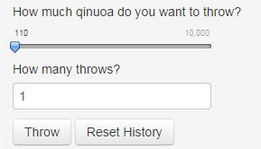
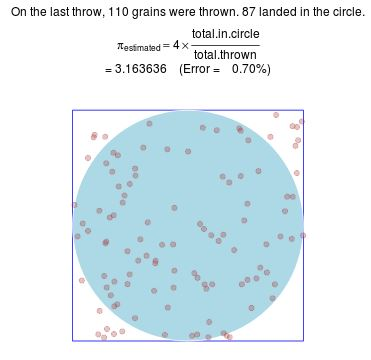
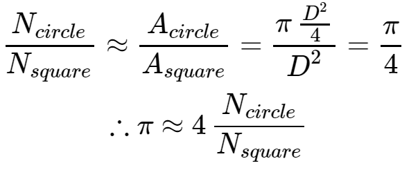
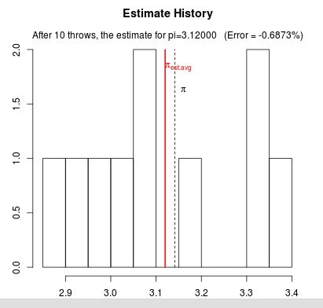
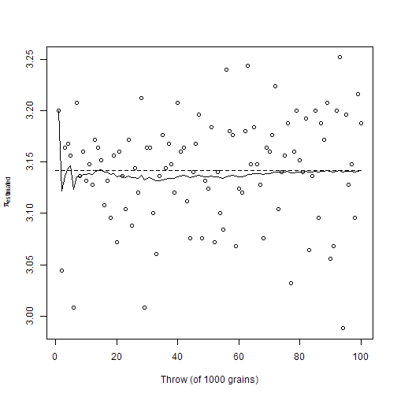

Quinoa Pi: Explaining the Monte Carlo Method
========================================================
author: Dave Hurst
date: 18-Sep-2014
transition: rotate

What is Monte Carlo Analysis
========================================================

- a statistical method of analysis
- Wikipedia has [an exhaustive description](http://en.wikipedia.org/wiki/Monte_Carlo_method) 
- A simple example is calculating pi based on the random throwing of objects
- [Quinoa Pi](https://dsdaveh.shinyapps.io/QuinoaPi/) is an app built to help visualize this

Using the Quinoa Pi app
========================================================
left: 40%

***
- Settings control how many grains are thrown
- Dots represent the grains thrown

Multiple throws improve the estimate
========================================================

***
- Red Line represents the estimate (average estimated value for all throws)
- Black (dashed) Line is the true value of $pi$

Use the app to study convergence
========================================================
left: 60%
- Which converges to $pi$ faster?  
-- 100 throws of 1,000 grains; or  
-- 1 throw of 10,000 grains  

***
 
